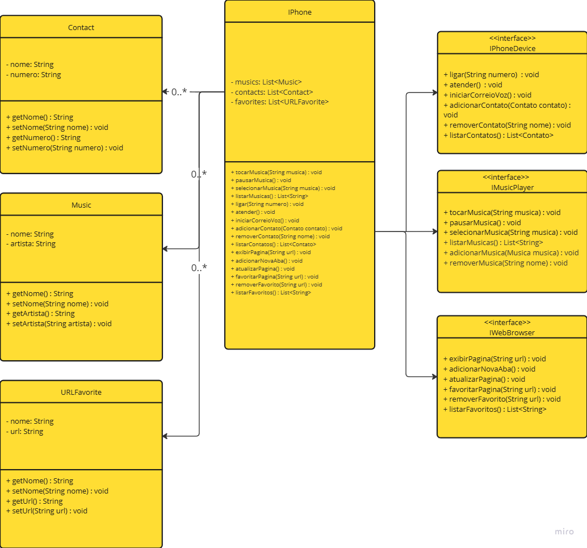

# 👩🏻‍💻**Desafio DIO: Modelagem UML e Implementação de Classes em Java**

Sou aluna na plataforma DIO (Digital Innovation One) e estou realizando este desafio do Programa ''Desenvolvendo Java com IA'' como parte de meu aprendizado em programação orientada a objetos e modelagem UML.

# **Descrição do Desafio**

Com base no vídeo de lançamento do iPhone conforme link abaixo, elabore em uma ferramenta de UML de sua preferência. A diagramação das classes e interfaces com a proposta de representar os papéis do iPhone de: Reprodutor Musical, Aparelho Telefônico e Navegador na Internet. Em seguida crie as classes e interfaces no formato de arquivos .java

[**Lançamento iPhone 2017**](https://www.youtube.com/watch?v=9ou608QQRq8)

Diagrama realizado por DaianeBs

**Ferramenta de UML:** Escolhi usar o Miro para criar os diagramas das classes e interfaces.
